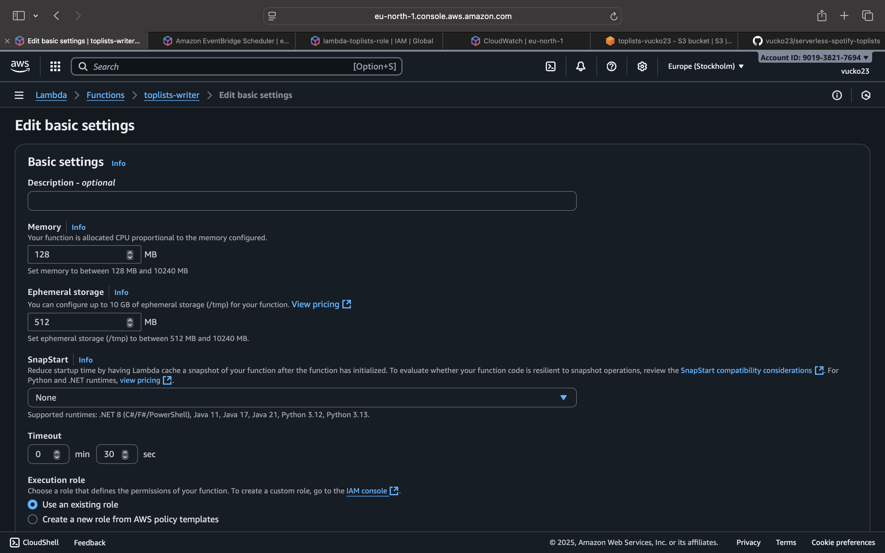
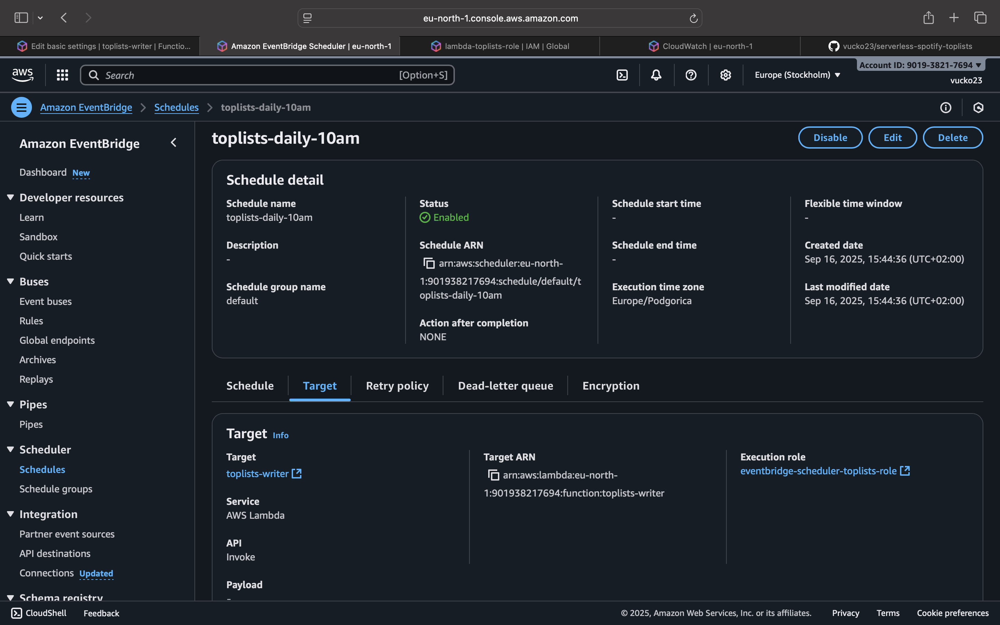
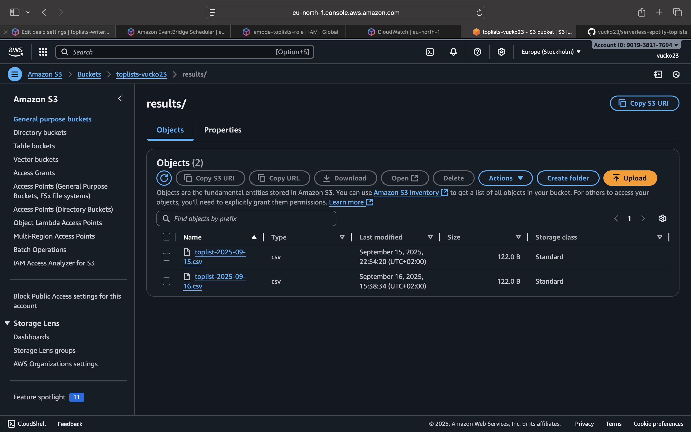

# serverless-spotify-toplists


Production-style starter for an AWS Lambda (Python 3.13) that writes a CSV to S3 on a schedule (EventBridge).

## Quickstart

```bash
python -m venv .venv && source .venv/bin/activate
pip install -r requirements.txt -r requirements-dev.txt
make test
make local-run
```

Outputs: `samples/sample-output.csv`

## ☁️ Deploy on AWS (manual steps)

1. **Create S3 bucket**Example: `toplists-vucko23` with prefix `results/`.
2. **Create Lambda function**

   - Runtime: Python 3.13
   - Handler: `lambda_handler.handler`
   - Upload: `build/lambda.zip`
3. **Set environment variables**

   - `OUTPUT_BUCKET = toplists-vucko23`
   - `OUTPUT_PREFIX = results/`
4. **Create EventBridge Scheduler (production)**

   - Expression: `cron(0 8 * * ? *)` → runs every day at 08:00 UTC (10:00 local time in summer).
   - Target: Lambda `toplists-writer`
   - Execution role: `eventbridge-scheduler-toplists-role`

---

## 📂 Example output

Sample file in S3 (`results/toplist-YYYY-MM-DD.csv`):

```csv
rank,track,artist,asof_date
1,Track A,Artist A,2025-09-16
2,Track B,Artist B,2025-09-16
3,Track C,Artist C,2025-09-16
```

### 📸 Screenshots

- 
  
  

#### 🏷️ Release

- v1.0.0 — Production-ready (Lambda + S3 + Scheduler + CI)
